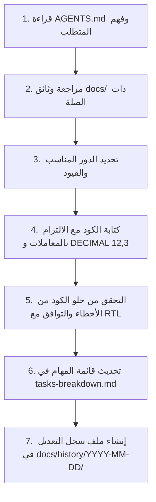

# 🤖 دليل تشغيل الذكاء الاصطناعي (AI Agent System Playbook)

> **⚠️ تنبيه إلزامي لأي AI Agent / Session قبل بدء أي عمل:**
> يجب قراءة هذا الملف بالكامل قبل كتابة أو تعديل أي سطر كود. هذا الملف يحدد قواعد العمل الصارمة، الهيكل التقني، دورك الحالي، ونظام تسجيل التغييرات اليومي الإلزامي (**History Log System**).

---

## 1. ملخص المشروع والقواعد التقنية الصارمة (Non-Negotiable Rules)

أنت تعمل على تطوير **"نظام إدارة الفواتير والمخزون والمبيعات"**، وهو **Laravel Monolith Web App** سريع وعملي (MVP قابل للتوسع) يعمل على أجهزة الكمبيوتر والموبايل (PWA).

### 🚫 المحظورات الصارمة (Strict Prohibitions):
1. **ممنوع استخدام `FLOAT` أو `DOUBLE` نهائيًا:** كافة القيم المالية والكميات والأوزان والخصومات والأسعار يجب أن تكون **`DECIMAL(12,3)`** وتُعالج بدوال `bcmath` في PHP.
2. **ممنوع تعديل المخزون أو الحسابات خارج `DB::transaction()`:** أي عملية تؤثر على الرصيد أو الفواتير يجب أن تتم داخل Transaction.
3. **ممنوع بيع الصنف دون قفل سطري:** استخدام `lockForUpdate()` إلزامي عند قراءة رصيد الصنف لخصمه لمنع الـ Race Conditions.
4. **ممنوع إدخال أطر عمل ثقيلة:** لا يوجد Vue.js ولا React ولا منفصل API Layer؛ الاعتماد كلي على **Livewire 4 + Alpine.js + Blade**.
5. **ممنوع الحذف الفيزيائي للبيانات الحساسة:** الفواتير المعتمدة تُلغى (`status = cancelled`) مع عكس الأثر المخزني ولا تُحذف من قاعدة البيانات.
6. **ممنوع كسر التوافق مع العربية:** النظام يعمل بـ `dir="rtl"`، خطوط Cairo/Tajawal، ومحاذاة منطقية بـ Tailwind.

---

## 2. مصفوفة تحديد دورك الحالي (Choose Your Role)

قبل تنفيذ المهمة المطلوبة، حدد الدور الذي ستمثله والتزم بحدوده:

```text
┌─────────────────────────────────────────────────────────────────────────────┐
│ 1. Backend Architect Agent                                                  │
│    - المسؤولية: Migrations, Models, Services, DB Transactions, lockForUpdate│
│    - الحظر: لا يكتب أكواد تصميم CSS أو واجهات Blade تفاعلية معقدة.          │
├─────────────────────────────────────────────────────────────────────────────┤
│ 2. Frontend / UI Agent                                                      │
│    - المسؤولية: Livewire 4 Components, Blade Layouts, Alpine.js, Tailwind   │
│    - الحظر: لا يكتب منطق مالي أو استعلامات SQL معقدة داخل الـ Components.  │
├─────────────────────────────────────────────────────────────────────────────┤
│ 3. QA & Testing Agent                                                       │
│    - المسؤولية: Unit & Feature Tests, اختبارات التزامن والـ Rollback        │
│    - الحظر: لا يعدل كود الخدمات في app/ لتجاوز فشل الاختبارات دون تصحيح.   │
├─────────────────────────────────────────────────────────────────────────────┤
│ 4. Docs & PM Agent                                                          │
│    - المسؤولية: تحديث docs/، متابعة tasks-breakdown.md، وسجلات التعديل.     │
│    - الحظر: لا يغير المتطلبات الأساسية دون توضيح أنها اقتراح إضافي.         │
└─────────────────────────────────────────────────────────────────────────────┘
```

---

## 3. البروتوكول الإلزامي لتسجيل التعديلات (AI History Protocol)

> **📌 قاعدة إلزامية:**
> بعد **أي تعديل أو إضافة برمجية** تقوم بها في المشروع، يجب عليك توثيق ما قمت به داخل مجلد التاريخ التالي:
> `docs/history/YYYY-MM-DD/` (حيث YYYY-MM-DD هو تاريخ اليوم الحالي، مثل `2026-08-08`).

### 3.1 هيكل مجلد التاريخ:
```text
docs/history/
└── YYYY-MM-DD/
    ├── session-01-feature-name.md
    ├── session-02-bugfix-name.md
    └── summary.md (ملخص تراكمي لليوم)
```

### 3.2 قالب ملف التوثيق الموحد لكل مهمة (History Log Template):
عند إنشاء ملف السجل داخل مجلد تاريخ اليوم، استخدم القالب التالي بدقة:

```markdown
# سجل تعديل: [اسم المهمة باختصار]

* **التاريخ والوقت:** YYYY-MM-DD HH:MM
* **الدور المفعل:** (Backend Architect / Frontend UI / QA Testing / Docs PM)
* **الهدف من التعديل:** [شرح في سطرين عن المشكلة أو الميزة المطلوبة]

---

## 1. الملفات التي تم إنشاؤها أو تعديلها (Modified Files)
* `[NEW/MODIFIED]` [مسار الملف الكامل] - [وصف التعديل]

---

## 2. القرارات المعمارية والمنطق البرمجي (Key Decisions)
* [قرار 1: مثل استخدام lockForUpdate لمنع البيع المزدوج]
* [قرار 2: مثل تطبيق DECIMAL(12,3)]

---

## 3. الاختبارات والتحقق (Verification & Testing)
* [ ] تم التحقق من عدم وجود أخطاء في الـ Syntax.
* [ ] تم اختبار الـ Rollback في حالة الفشل.
* [ ] تم فحص اتجاه النصوص في العربية RTL والوضع الليلي.

---

## 4. الخطوات التالية المقترحة (Next Recommended Steps)
1. [المهمة التالية المرتبطة في tasks-breakdown.md]
```

---

## 4. مسار العمل القياسي لكل مهمة (Standard Workflow Checklist)

عندما يطلب منك المستخدم أي تعديل أو ميزة، اتبع هذا التسلسل خطوة بخطوة:



1. **الخطوة 1:** راجع ملفات التوثيق ذات الصلة في `docs/`:
   * للعمليات المالية والمخزنية: راجع `docs/03-architecture/backend-architecture.md`
   * للجداول والحقول: راجع `docs/03-architecture/database-schema.md`
   * للواجهات ومكونات Livewire: راجع `docs/03-architecture/frontend-architecture.md`
2. **الخطوة 2:** نفذ الكود البرمجي النظيف والمتناسق.
3. **الخطوة 3:** حدّث ملف `docs/05-planning/tasks-breakdown.md` وضع علامة `[x]` على المهام التي أنجزتها.
4. **الخطوة 4:** أنشئ ملف السجل في `docs/history/YYYY-MM-DD/` وسجل فيه تفاصيل عملك بدقة.
