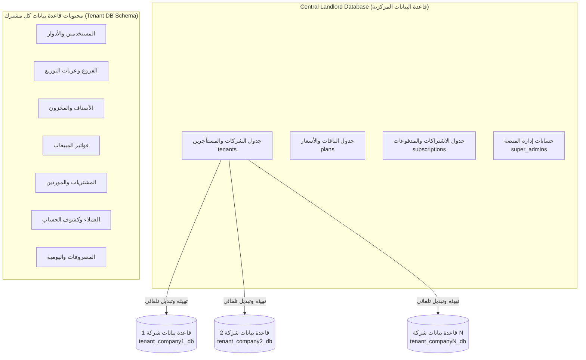
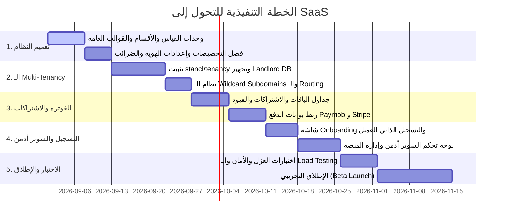

# 🚀 الدليل المعماري الشامل وخطة التحول لمنصة سحابية (SaaS Multi-Tenant ERP)

> **وثيقة معمارية واستراتيجية:** تحدد هذه الوثيقة المتطلبات الفنية، معمارية قواعد البيانات، نموذج تعدد المستأجرين (Multi-Tenancy)، خطة تجريد النظام لخدمة كافة الأنشطة التجارية، ونظام الاشتراكات والفوترة للتحول إلى منصة SaaS متكاملة.

---

## 1. مقارنة الوضع الحالي والوضع المستهدف (Current vs SaaS Architecture)

```text
┌───────────────────────────────────────────────────┐          ┌────────────────────────────────────────────────────┐
│              الوضع الحالي (Current ERP)           │          │             الوضع المستهدف (SaaS Platform)         │
├───────────────────────────────────────────────────┤          ├────────────────────────────────────────────────────┤
│ • Single Tenant (شركة واحدة وسيرفر واحد)          │   ───►   │ • Multi-Tenant (آلاف المشتركين والشركات المستقلة)  │
│ • مخصص لنشاط تجارة البن (شكارة/بن/توليفات)        │   ───►   │ • نظام ديناميكي عام لأي نشاط تجاري (تجزئة وجملة)   │
│ • نطاق واحد مخصص                                  │   ───►   │ • Wildcard Subdomains (e.g. company.yourdomain.com)│
│ • لا يوجد نظام خطط ودفع واشتراكات                │   ───►   │ • باقات شهرية/سنوية وبوابات دفع إلكتروني مدمجة     │
│ • إدخال يدوي للمستخدمين                           │   ───►   │ • Onboarding وتسجيل فوري ذاتي وتجربة مجانية 14 يوم │
└───────────────────────────────────────────────────┘          └────────────────────────────────────────────────────┘
```

---

## 2. معمارية قواعد البيانات وعزل المستأجرين (Database Architecture)

### 🏆 الاستراتيجية المعتمدة: قاعدة بيانات لكل مشترك (Database per Tenant via `stancl/tenancy`)



### أسباب اختيار معمارية (Database per Tenant):
1. **عزل أمني وفيزيائي 100%:** بيانات كل شركة في قاعدة بيانات مستقلة؛ استحالة تداخل البيانات بين المشتركين.
2. **الحفاظ على الكود الحالي (99% Code Reusability):** الحفاظ على كافة العلاقات والاستعلامات الحسابية بـ `DECIMAL(12,3)` و `bcmath` و `lockForUpdate` دون الحاجة لحشر `tenant_id` في مئات الاستعلامات.
3. **النسخ الاحتياطي والاستقلالية:** إمكانية أخذ نسخة احتياطية لأي شركة وتصديرها بضغطة زر واحدة دون التأثير على بقية المشتركين.

---

## 3. تعميم النظام وإلغاء تخصيص البن (Domain Generalization)

لجعل النظام قابلاً للعمل مع أي نشاط تجاري (سوبرماركت، ملابس، مطاعم، قطع غيار، عطارة، إلكترونيات، جملة وتوزيع):

### 3.1 وحدات القياس الديناميكية (Dynamic Measurement Units)
* إضافة جدول وشاشة لإدارة وحدات القياس (`units`):
  * قطعة (Piece)، كرتونة (Carton)، دستة (Dozen)، كجم (Kg)، جرام (Gram)، لتر (Liter)، متر (Meter)، شكارة (Sack)، علبة (Box).
* **معاملات التحويل (Unit Conversions):** مثلاً (1 كرتونة = 24 قطعة) لتمكين البيع بالقطعة أو الكرتونة مع خصم المخزون بدقة.

### 3.2 قوالب الأنشطة التجارية المسبقة (Industry Presets)
عند تسجيل العميل لأول مرة، يختار نوع نشاطه، ويقوم النظام بتفعيل التهيئات التلقائية:
* **سوبرماركت / بقالة:** تفعيل قراءة الباركود السريع، الميزان الإلكتروني، وحدات (قطعة، كرتونة، كجم).
* **محلات ملابس وأحذية:** تفعيل متغيرات الألوان والمقاسات (Variants / Matrix).
* **عطارة ومحامص:** تفعيل الأوزان بالجرام والكيلو والتعبئة والشوال.
* **مطاعم وكافيهات:** تفعيل شاشة طلبات الكاشير السريع وطباعة بون المطبخ.
* **قطع غيار ومواد بناء:** تفعيل أرقام القطع والماركات والموديلات.

### 3.3 الهوية المخصصة للشركات (White-Labeling)
* رفع شعار الشركة واسمها التجاري وبيانات السجل والبطاقة الضريبية.
* تخصيص ترويسة وتذييل الفاتورة الحرارية (80mm / 57mm) وفواتير A4/A5.
* ضبط العملة (ج.م، ريال سعودي، درهم، دينار، دولار...).
* تخصيص نسب الضريبة (ضريبة القيمة المضافة 14% أو 15% أو معفي).

---

## 4. نظام الاشتراكات والباقات وبوابات الدفع (Billing Engine)

### 4.1 هيكل الباقات المقترح (Pricing Tiers)

| الباقة | الفروع وعربات التوزيع | المستخدمين | حد الفواتير | الميزات الإضافية |
| :--- | :---: | :---: | :---: | :--- |
| **المبتدئ (Starter)** | 1 فرع | 2 مستخدم | 500 فاتورة/شهر | نقطة بيع POS، مخزون، كشوف حسابات |
| **النمو (Pro)** | 3 فروع / عربيات | 5 مستخدمين | غير محدود | أذونات تحويل، تقارير أرباح متقدمة، دعم واتساب |
| **الشركات (Enterprise)** | غير محدود | غير محدود | غير محدود | ربط API، نطاق مخصص (Custom Domain)، نسخ سحابي يومي |

### 4.2 بوابات الدفع الإلكتروني (Payment Gateways)
* **مصر:** فوري (Fawry)، باي موب (Paymob)، بطاقات ميزة، محافظ إلكترونية (فودافون كاش، إنستاباي).
* **الخليج والعالم:** Stripe, Moyasar, MyFatoorah, Tap Payments.

### 4.3 دورة حياة المشترك (Lifecycle Management)
* **فترة تجريبية مجانية (14 Days Free Trial):** تبدأ فوراً دون الحاجة لبطاقة بنكية.
* **التنبيهات التلقائية:** رسائل تذكير قبل انتهاء الاشتراك بـ 7 أيام و 3 أيام ويوم واحد عبر WhatsApp والبريد.
* **وضع القراءة فقط (Read-Only Mode):** عند انتهاء الاشتراك لحماية البيانات دون حذفها، مع إمكانية التجديد الفوري.

---

## 5. إدارة المنصة والسوبر أدمن (Super Admin SaaS Dashboard)

* **لوحة المؤشرات المركزية:** متابعة الإيرادات المتكررة (MRR / ARR)، معدل إلغاء الاشتراكات (Churn Rate)، وعدد المشتركين النشطين.
* **إدارة المستأجرين (Tenant Management):** تفعيل، إيقاف، تمديد الفترات التجريبية، وتعديل الباقات.
* **الدخول كعميل (Impersonation):** إمكانية دخول السوبر أدمن للوحة أي مشترك لحل مشاكل الدعم الفني دون طلب كلمة المرور.

---

## 6. خطة التنفيذ المرحلية (Implementation Roadmap)



---

> 📝 **ملاحظة للمناقشة والتطوير المستقبلي:**
> تم حفظ هذه الوثيقة كمرجع أساسي للمنصة. سنقوم بإضافة وتعديل أي نقاط جديدة يطرحها فريق العمل قبل بدء مرحلة التطوير الفعلي.
