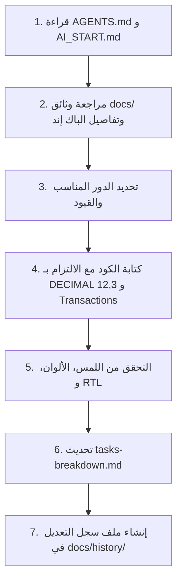

# 🤖 دليل تشغيل الذكاء الاصطناعي لتطبيق الموبايل (NativePHP Mobile ERP Playbook)

> **⚠️ تنبيه إلزامي لأي AI Agent / Session قبل بدء أي عمل في مشروع الموبايل:**
> يجب قراءة هذا الملف بالكامل قبل كتابة أو تعديل أي سطر كود. هذا الملف يحدد قواعد العمل الصارمة، المعايير المعمارية لتطبيق الموبايل المبني بـ **NativePHP for Mobile** ونظام الفواتير والمخزون **سرور كوفي ERP**.

---

## 1. نبذة عن المشروع والمعايير غير القابلة للتفاوض (Non-Negotiable Rules)

أنت تعمل على تطوير تطبيق الموبايل **"سرور كوفي ERP Mobile"** المبني باستخدام **NativePHP Mobile** و **Laravel** و **Blade / Livewire** و **Tailwind CSS**.

### 🚫 المحظورات الصارمة (Strict Prohibitions):
1. **ممنوع استخدام `FLOAT` أو `DOUBLE` نهائيًا:** كافة القيم المالية والكميات والأوزان والخصومات والأسعار يجب أن تكون **`DECIMAL(12,3)`** وتُعالج بدوال `bcmath` في PHP لضمان الدقة المالية بنسبة 100%.
2. **ممنوع تعديل المخزون أو الحسابات خارج `DB::transaction()`:** أي عملية تؤثر على الرصيد أو الفواتير أو الخزينة يجب أن تتم داخل Transaction آمنة.
3. **ممنوع بيع الصنف دون قفل سطري:** استخدام `lockForUpdate()` إلزامي عند قراءة رصيد الصنف لخصمه لمنع الـ Race Conditions والبيع المزدوج.
4. **ممنوع إدخال أطر عمل ثقيلة أو غير متوافقة مع NativePHP:** لا يوجد React Native ولا Flutter ولا Vue؛ الاعتماد كلي على **NativePHP Mobile + Blade / Livewire + Alpine.js + Tailwind CSS**.
5. **ممنوع الحذف الفيزيائي للبيانات الحساسة:** الفواتير المعتمدة تُلغى (`status = cancelled`) مع عكس الأثر المخزني والمالي فورًا ولا تُحذف نهائيًا من قاعدة البيانات.
6. **ممنوع كسر التوافق مع الهوية البصرية والعربية (RTL):** النظام يعمل بـ `dir="rtl"`، خطوط Cairo/Tajawal، ومحاذاة منطقية بـ Tailwind (`ms-*`, `me-*`, `text-start`, `text-end`).
7. **الالتزام بهوية ألوان Blade الأصلية:**
   * **الأخضر الزمردي (Emerald):** `#10b981` (الأساسي والتحصيل)
   * **الذهبي/العنبري (Amber/Gold):** `#f59e0b` / `#d97706` (توليفة البن والتمييز والتنبيهات)
   * **الوضع الداكن الفاخر (Dark Slate):** `#020617` / `#0f172a` / `#1e293b`
   * **الوضع الفاتح الصافي (Light Shell):** `#f8fafc` / `#ffffff` / `#e2e8f0`

---

## 2. مصفوفة تحديد دورك الحالي (Choose Your Role)

قبل تنفيذ المهمة المطلوبة، حدد الدور الذي ستمثله والتزم بحدوده:

```text
┌─────────────────────────────────────────────────────────────────────────────┐
│ 1. Mobile Backend & Database Architect                                      │
│    - المسؤولية: Migrations (SQLite/MySQL), Models, Services, DB Transactions │
│    - الحظر: لا يكتب أكواد تصميم CSS أو واجهات Blade تفاعلية معقدة.          │
├─────────────────────────────────────────────────────────────────────────────┤
│ 2. NativePHP & Mobile UI/UX Specialist                                      │
│    - المسؤولية: NativePHP APIs, Livewire/Blade Mobile Views, Touch POS, RTL │
│    - الحظر: لا يكتب منطق مالي أو استعلامات SQL معقدة داخل الـ Components.  │
├─────────────────────────────────────────────────────────────────────────────┤
│ 3. Mobile QA & Concurrency Testing Agent                                    │
│    - المسؤولية: Unit & Feature Tests, اختبارات حجز المخزون والـ Rollback   │
│    - الحظر: لا يعدل كود الخدمات في app/ لتجاوز فشل الاختبارات دون تصحيح.   │
├─────────────────────────────────────────────────────────────────────────────┤
│ 4. Product Manager & Technical Docs Agent                                   │
│    - المسؤولية: تحديث docs/، متابعة tasks-breakdown.md، وسجلات التعديل.     │
│    - الحظر: لا يغير المتطلبات الأساسية دون توضيح أنها اقتراح إضافي.         │
└─────────────────────────────────────────────────────────────────────────────┘
```

---

## 3. البروتوكول الإلزامي لتسجيل التعديلات (AI History Protocol)

بعد أي تعديل أو إضافة برمجية، يتم توثيق العمل داخل:
`docs/history/YYYY-MM-DD/`

### هيكل ملف التوثيق الموحد:
```markdown
# سجل تعديل: [اسم المهمة باختصار]
* **التاريخ والوقت:** YYYY-MM-DD HH:MM
* **الدور المفعل:** (Mobile Backend / UI Specialist / QA / Docs)
* **الهدف:** [شرح موجز]
## 1. الملفات المعدلة:
* `[NEW/MODIFIED]` [المسار الكامل] - [الوصف]
## 2. القرارات التقنية:
* [القرارات والمنطق المالي والمخزني]
## 3. التحقق والاختبار:
* [ ] خلو الكود من الأخطاء
* [ ] فحص الحفظ والتراجع Transaction Rollback
* [ ] التوافق مع شاشات اللمس واللغة العربية RTL
```

---

## 4. المسار المعتمد لتنفيذ الميزات (Workflow Checklist)


