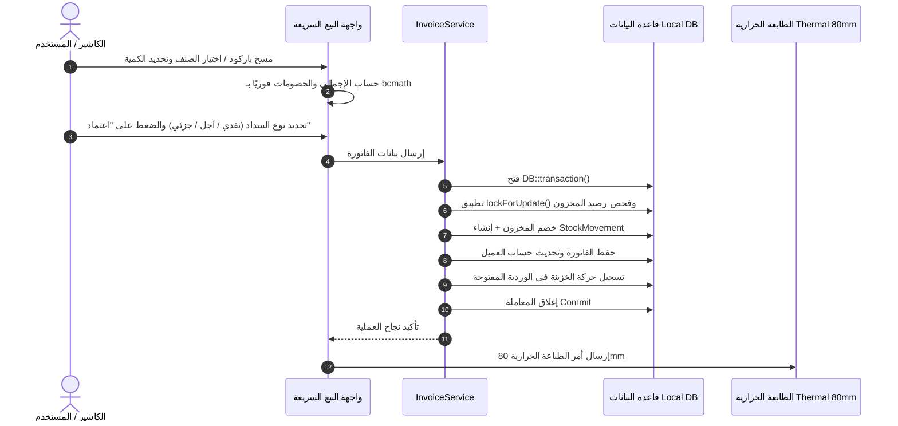

# الهيكل المعماري لتطبيق الموبايل (NativePHP Mobile ERP Architecture)

## 1. نظرة عامة (Overview)
تطبيق **سرور كوفي ERP Mobile** مبني بتقنية **NativePHP for Mobile** ليقدم تجربة أصلية بالكامل (Native App) على أجهزة Android و iOS مستفيدًا من قوة Laravel و Blade و Tailwind CSS.

---

## 2. الطبقات المعمارية (Architectural Layers)

```text
┌─────────────────────────────────────────────────────────────┐
│                    Native Mobile App Shell                  │
│               (NativePHP Mobile Engine / WebView)           │
├─────────────────────────────────────────────────────────────┤
│                    Presentation Layer                       │
│  - Blade Mobile Components                                  │
│  - Livewire 4 Reactive UI                                   │
│  - Alpine.js Mobile Interactions                            │
│  - Tailwind CSS 4.x Design Tokens (Emerald & Dark Slate)    │
├─────────────────────────────────────────────────────────────┤
│                    Application & Service Layer              │
│  - InvoiceService (POS, Sales, Calculations, bcmath)        │
│  - StockService (Movements, Transfers, lockForUpdate)       │
│  - PaymentService (Collections, Settlements)                │
│  - CoffeeBlenderService (Roastery Batch Recipes)            │
│  - DailyJournalService (Cash Shifts, Cash Drawer)           │
├─────────────────────────────────────────────────────────────┤
│                    Domain & Persistence Layer               │
│  - Eloquent Models (DECIMAL 12,3 Casts)                     │
│  - Local Database (SQLite / MySQL)                          │
│  - DB Transactions & Row-level Locking                      │
├─────────────────────────────────────────────────────────────┤
│                    Device Hardware Integration              │
│  - Bluetooth / Thermal Receipt Printing (80mm)              │
│  - Camera Barcode Scanner                                   │
│  - Local File System & PDF/Excel Export                     │
│  - Local Notifications & Stock Alerts                       │
└─────────────────────────────────────────────────────────────┘
```

---

## 3. قواعد الحسابات المالية والدقة (Financial Rules & Precision)

1. **النوع الموحد للبيانات:** `DECIMAL(12,3)` لكافة القيم المالية والكميات والأوزان.
2. **العمليات الحسابية:** استخدام مكتبة `bcmath` في PHP لجميع العمليات الحسابية:
   * `bcadd($a, $b, 3)` (الجمع)
   * `bcsub($a, $b, 3)` (الطرح)
   * `bcmul($a, $b, 3)` (الضرب)
   * `bcdiv($a, $b, 3)` (القسمة)
3. **فصل التكلفة عن سعر البيع (Cost Price ≠ Selling Price):**
   * يتم تسجيل سعر التكلفة لحظة الشراء أو إيداع المخزون.
   * حساب متوسط التكلفة المرجح (Weighted Average Cost).
   * حساب الربح لحظيًا: `Profit = Net Price - Cost Price`.

---

## 4. تدفق دورة حياة الفاتورة ونقاط البيع (POS Life Cycle)


